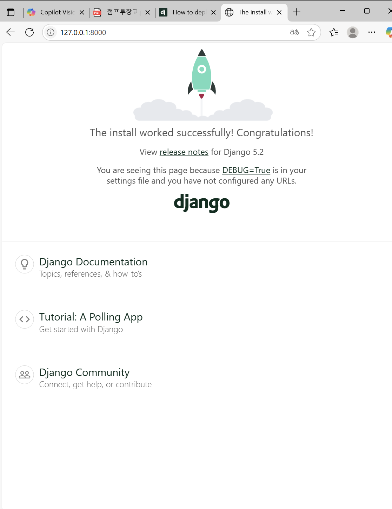

# 점프 투 장고

상태: 완료
담당자: Jaeyeon 재연

# 목표

1. 장고 프로젝트를 만들어 첫 번째 프로그램을 만든다
    1. 파이썬과 장고를 설치하고 개발 환경을 준비한다
2. 장고 서버를 실행하고 실행 결과를 확인한다

## 장고란..?

웹 프로그램을 쉽고 빠르게 만들어 주는 웹 프레임워크

보안기능 b

# 파이썬 설치하기

[www.python.org](http://www.python.org) 에서 가장 최신 버전 설치

<윈도우 키 +r> → cmd 입력 → Enter 한 후 아래 코드 입력

```python
C:\Users\재연>python -V
Python 3.13.5
```

# 장고 개발 환경 준비하기

## 가상환경 만들기

[명령프롬프트]

```python
C:\Users\재연> cd
C:\> mkdir venvs
C:\> cd venvs    #C:/venvs라는 디렉터리를 만든 것

C:\venvs> python-m venv mysite 
#파이썬 가상환경 만드는 명령어
#-m venv : venv 라는 모듈을 사용한다는 의미
```

→ C:/venvs 디렉터리 안에 mysite 디렉터리 생성됨!!  ==가상환경

## 가상환경 진입하기

[명령프롬프트]

```python
C:\venvs>cd C:\venvs\mysite\Scripts
C:\venvs\mysite\Scripts> activate
(mysite) C:\venvs\mysite\Scripts>   #() 안의 가상환경에 진입했다는 의미
```

벗어날 때는 

```python
(mysite) C:\venvs\mysite\Scripts> deactivate
c:\venvs\mysite\Scripts> #벗어났기 때문에 (mysite) 사라짐
```

## 장고 설치하기

mysite (가상환경) 에 진입한 상태에서 시작

```python
(mysite) C:\venvs\mysite\Scripts> pip install django
```

pip: 파이썬 라이브러리를 설치하고 관리하는 도구

# 장고 프로젝트 생성하기

### 루트 디렉터리 생성

```python
 C:\Users\재연>cd \
 C:\>mkdir projects
 C:\>cd projects
 C:\projects>
```

### mysite 진입(아까 했던거 )

```python
C:\projects> C:\venvs\mysite\Scripts\activate
(mysite) C:\projects>
```

### 장고 프로젝트 생성

```python
(mysite) C:\projects>mkdir mysite
(mysite) C:\projects>cd mysite
(mysite) C:\projects\mysite>

(mysite) C:\projects\mysite>django-admin startproject config .
#장고 프로젝트 생성하는 명령문
#점 기호(.) : 현재 디렉터리 -> mysite 기준으로 프로젝트 생성
```

### 개발 서버 구동하고 웹사이트 접속해 보기

```python
(mysite) C:\projects\mysite>python manage.py runserver

....

Starting development server at http://127.0.0.1:8000/
Quit the server with CONTROL-C.
```

여기서 [http://127.0.0.1:8000/](http://127.0.0.1:8000/) 에 들어가기

결과: 



### mysite 가상 환경에 간단히 진입하도록 설정

1. [노트패드] mysite.cmd 파일 작성하기 .. 
    
    file name: C:/venvs/mysite.cmd
    
    ```python
     cd c:/projects/mysite
     c:/venvs/mysite/scripts/activate
     
     """ 
     C:/projects/mysite 디렉터리로 이동하고,
     아래 C:/venvs?mysite/scripts/activate  명령 수행
     """
    ```
    

1. C:/venvs 디렉터리를 환경변수 PATH 에 추가하기
    
    <윈도우키+R>→ sysdm.cpl 입력 →Enter
    
    시스템 속성 창 ) <고급>→ <환경 변수> → <PATH> → <편집>→ <새로만들기>
    
    → <C:\venvs 추가> →<확인>
    
2. 확인
    
    ```python
    C:\Users\재연>set path
    
    C:\Users\재연> mysite
    (mysite) C:\projects\mysite>
    ```
    

# 에디터 사용(비주얼 스튜디오, 파이참)


비주얼 스튜디오


파이참

## [setting.py](http://setting.py) 수정

```python
LANGUAGE_CODE = 'ko-kr'

TIME_ZONE = 'Asia/Seoul'

#로 수정한 후에 터미널 창에서
(mysite) c:\projects\mysite>python manage.py runserver
```

결과:

